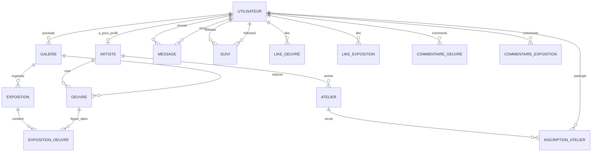

# Base de donnees ArtConnect - MCD / MLD

## 1) Contexte fonctionnel
Cette base de donnees couvre les modules principaux de l'application ArtConnect:
- gestion des utilisateurs
- profils artistes
- galeries
- oeuvres
- expositions
- ateliers
- interactions communaute (suivis, messages, commentaires, likes)

## 2) MCD (Modele Conceptuel de Donnees)

### 2.1 Entites principales
- Utilisateur
- Artiste
- Galerie
- Oeuvre
- Exposition
- Atelier
- Message
- Commentaire

### 2.2 Relations et cardinalites
- Un Utilisateur peut etre Artiste (0,1) ; un Artiste est lie a exactement un Utilisateur (1,1).
- Un Utilisateur (proprietaire) possede zero a plusieurs Galeries (0,N).
- Un Artiste cree zero a plusieurs Oeuvres (0,N).
- Une Galerie expose zero a plusieurs Oeuvres (0,N).
- Une Galerie organise zero a plusieurs Expositions (0,N).
- Une Exposition presente une ou plusieurs Oeuvres via une relation N,N.
- Un Artiste anime zero a plusieurs Ateliers (0,N).
- Un Atelier admet zero a plusieurs participants Utilisateur via une relation N,N.
- Un Utilisateur peut suivre plusieurs Utilisateurs (N,N auto-reference).
- Un Utilisateur envoie des Messages a d'autres Utilisateurs (1,N).
- Un Utilisateur peut liker/commenter des Oeuvres et des Expositions.

### 2.3 Diagramme MCD (vue conceptuelle)


## 3) MLD (Modele Logique de Donnees)

### 3.1 Choix de modelisation
- Passage en schema relationnel SQL (MySQL 8+).
- Tables d'association pour les relations N,N:
  - exposition_oeuvre
  - inscription_atelier
  - suivi
- Separation des tables de likes/commentaires par cible (oeuvre vs exposition) pour eviter des colonnes nullables ambigu es et simplifier les contraintes.
- Clés etrangeres avec ON DELETE adaptees aux usages metier.

### 3.2 Diagramme MLD (vue relationnelle)
```mermaid
erDiagram
    users {
        BIGINT id PK
        VARCHAR username UK
        VARCHAR email UK
        VARCHAR password_hash
        VARCHAR first_name
        VARCHAR last_name
        TEXT bio
        VARCHAR profile_picture_url
        TIMESTAMP created_at
        TIMESTAMP updated_at
    }

    artists {
        BIGINT id PK
        BIGINT user_id FK UK
        VARCHAR specialty
        INT experience_years
        VARCHAR portfolio_url
        BOOLEAN verified
        DECIMAL rating
        TIMESTAMP created_at
    }

    galleries {
        BIGINT id PK
        BIGINT owner_id FK
        VARCHAR name
        TEXT description
        VARCHAR address
        VARCHAR city
        VARCHAR country
        VARCHAR phone
        VARCHAR website
        VARCHAR logo_url
        BOOLEAN verified
        DECIMAL rating
        TIMESTAMP created_at
    }

    artworks {
        BIGINT id PK
        BIGINT artist_id FK
        BIGINT gallery_id FK
        VARCHAR title
        TEXT description
        VARCHAR category
        VARCHAR style
        VARCHAR medium
        DECIMAL price
        VARCHAR image_url
        DECIMAL width
        DECIMAL height
        DECIMAL depth
        DATE creation_date
        BOOLEAN available
        TIMESTAMP created_at
    }

    exhibitions {
        BIGINT id PK
        BIGINT gallery_id FK
        VARCHAR title
        TEXT description
        DATE start_date
        DATE end_date
        VARCHAR opening_hours
        DECIMAL ticket_price
        VARCHAR poster_url
        INT capacity
        INT current_visitors
        TIMESTAMP created_at
    }

    exhibition_artworks {
        BIGINT exhibition_id FK
        BIGINT artwork_id FK
        INT position
        PK(exhibition_id, artwork_id)
    }

    workshops {
        BIGINT id PK
        BIGINT artist_id FK
        BIGINT gallery_id FK
        VARCHAR title
        TEXT description
        VARCHAR level
        INT max_participants
        DATETIME start_date
        DATETIME end_date
        DECIMAL price
        VARCHAR image_url
        TIMESTAMP created_at
    }

    workshop_participants {
        BIGINT workshop_id FK
        BIGINT user_id FK
        VARCHAR status
        TIMESTAMP registration_date
        PK(workshop_id, user_id)
    }

    follows {
        BIGINT follower_id FK
        BIGINT followed_id FK
        TIMESTAMP follow_date
        PK(follower_id, followed_id)
    }

    messages {
        BIGINT id PK
        BIGINT sender_id FK
        BIGINT receiver_id FK
        TEXT content
        TIMESTAMP sent_date
        TIMESTAMP read_date
    }

    artwork_likes {
        BIGINT user_id FK
        BIGINT artwork_id FK
        TIMESTAMP like_date
        PK(user_id, artwork_id)
    }

    exhibition_likes {
        BIGINT user_id FK
        BIGINT exhibition_id FK
        TIMESTAMP like_date
        PK(user_id, exhibition_id)
    }

    artwork_comments {
        BIGINT id PK
        BIGINT user_id FK
        BIGINT artwork_id FK
        TEXT content
        INT rating
        TIMESTAMP comment_date
    }

    exhibition_comments {
        BIGINT id PK
        BIGINT user_id FK
        BIGINT exhibition_id FK
        TEXT content
        INT rating
        TIMESTAMP comment_date
    }

    users ||--o| artists : user_id
    users ||--o{ galleries : owner_id
    artists ||--o{ artworks : artist_id
    galleries ||--o{ artworks : gallery_id
    galleries ||--o{ exhibitions : gallery_id
    exhibitions ||--o{ exhibition_artworks : exhibition_id
    artworks ||--o{ exhibition_artworks : artwork_id
    artists ||--o{ workshops : artist_id
    galleries ||--o{ workshops : gallery_id
    workshops ||--o{ workshop_participants : workshop_id
    users ||--o{ workshop_participants : user_id
    users ||--o{ follows : follower_id
    users ||--o{ follows : followed_id
    users ||--o{ messages : sender_id
    users ||--o{ messages : receiver_id
    users ||--o{ artwork_likes : user_id
    artworks ||--o{ artwork_likes : artwork_id
    users ||--o{ exhibition_likes : user_id
    exhibitions ||--o{ exhibition_likes : exhibition_id
    users ||--o{ artwork_comments : user_id
    artworks ||--o{ artwork_comments : artwork_id
    users ||--o{ exhibition_comments : user_id
    exhibitions ||--o{ exhibition_comments : exhibition_id
```

## 4) Explications de conception
- La table users centralise l'authentification et les informations communes.
- La table artists prolonge users en profil metier (relation 1:1).
- Les tables de jointure en cle primaire composee evitent les doublons naturels:
  - une meme oeuvre ne peut etre ajoutee qu'une fois a une exposition
  - un utilisateur ne peut s'inscrire qu'une fois a un atelier
  - un utilisateur ne peut suivre une meme personne qu'une fois
- Les tables de likes sont separees par type de ressource pour conserver l'integrite et accelerer les requetes.
- Les dates et statuts permettent le suivi metier (inscriptions, lecture des messages, disponibilite des oeuvres).

## 5) Script SQL
Le script SQL complet de creation se trouve dans:
- sql/artconnect_schema.sql
